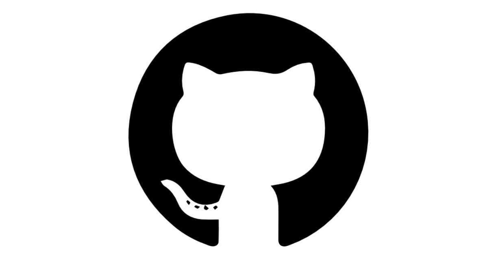

# Homework Page


[Back to Home Page](./README.md)


## git & github




## Markdown

[Markdown - Wikipedia](https://en.wikipedia.org/wiki/Markdown)


### Title

#### fourth-level title

##### fifth-level title

###### sixth-level title


### Code Block

```markdown
## second-level title

#### fourth-level title
```

```c++
#include<iostream>
int main(){
    std::cout << "Hello World" << std::endl;
}
```

```java
class Program {
	public static void main(String[] args) {
		System.out.println("Hello, world.");
	}
}
```

```C#
Console.WriteLine("Hello, World!");
```

```python
print("Hello world")
```


### Block Quote

> Markdown is a lightweight markup language for creating formatted text using a plain-text editor. John Gruber and Aaron Swartz created Markdown in 2004 as a markup language that is appealing to human readers in its source code form.[9] Markdown is widely used in blogging, instant messaging, online forums, collaborative software, documentation pages, and readme files.
>
> The initial description of Markdown[10] contained ambiguities and raised unanswered questions, causing implementations to both intentionally and accidentally diverge from the original version. This was addressed in 2014, when long-standing Markdown contributors released CommonMark, an unambiguous specification and test suite for Markdown.[11]
>
> ​																																—— Wikipedia


### List

- unordered list item1
- unordered list item2
- unordered list item3

1. numbered list item1
2. numbered list item2
3. numbered list item3


### Table

| Tools    | Pioneer                                                      | Similar products |
| -------- | ------------------------------------------------------------ | ---------------- |
| git      | Linus Benedict Torvalds                                      | SVN              |
| github   | Tom Preston-Werner<br/>Chris Wanstrath<br/>P. J. Hyett<br/>Scott Chacon | gitee            |
| markdown | John Gruber<br />Aaron Swartz                                | None             |


### Text

**bolded text**

*Italicized text*

~~strikerthrough text~~