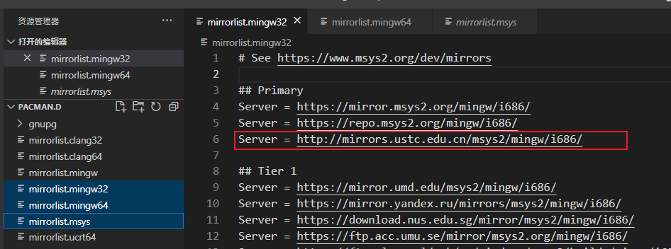

# Windows开发环境配置记录


[TOC]


---

## Windows 10


### 输入法


**安装美式键盘输入法**

- 时间和语言-> 语言 -> 首选语言 -> 添加语言 -> 英语(美国)


### 系统命令

1. where: 查询环境变量的位置.

   ```powershell
   where git
   ```

   > cmd中可用,powershell失效.


## 技巧


```cmd
mklink /j "默认的位置" "自定义的位置"
```

- 可用于C盘文件的转移

  - 比如用户目录/Appdata里的数据
    - QQ、微信都有效

- 可用于Docker的安装目录转移

  ```cmd
  # Docker的安装位置：
  #    C:\Program Files\Docker
  #    C:\ProgramData\Docker
  #    C:\Users\_你的用户名\AppData\Local\Docker
  #    C:\Users\_你的用户名\AppData\Roaming\Docker
  
  mklink /j "C:\Program Files\Docker" "自定义的位置"
  mklink /j "C:\ProgramData\Docker" "自定义的位置"
  mklink /j "C:\Users\_你的用户名\AppData\Local\Docker" "自定义的位置"
  mklink /j "C:\Users\_你的用户名\AppData\Roaming\Docker" "自定义的位置"
  ```
  
  - 注意要先将2~6行已有的文件夹(默认的位置)删掉,是要在该目录下直接创建文件夹的跳转链接,与同名文件夹是冲突的.

> 本机mklink记录
>
> ```powershell
> mklink /j "C:\Users\axdhy\.cursor" "D:\__Programming_Software__\Text_Editor\Visual_Studio_Code\Cursor\__Extra_Documents\Data_From_C\.cursor"
> ```
>
> 


**文件夹正在使用**

> 操作无法完成,因为其中的文件夹或文件已在另一程序中打开.请关闭该文件夹或文件,然后重试.

解决方案

- 使用Windows自带工具"资源监视器",切换到**CPU页**,在**关联的句柄**视图中,输入被占用文件名,即可查询相关占用应用进程并可以选择关闭.


### powershell

查询电脑信息

- ```powershell
  systeminfo
  ```

#### 运行脚本

> 无法加载文件 xxx.脚本，因为在此系统上禁止运行脚本。有关详细信息，请参阅[https:/go.microsoft.com/fwlink/?LinkID=135170](https://go.microsoft.com/fwlink/?LinkID=135170)中的 about_Execution_Policies.
>
> 管理员权限
>
> ```powershell
> Get-ExecutionPolicy #查看当前脚本运行权限
> Set-ExecutionPolicy RemoteSigned #设置当前脚本权限为RemoteSigned
> ```
>
> | 组策略                     | 执行策略     |
> | :------------------------- | :----------- |
> | 允许所有脚本               | Unrestricted |
> | 允许本地脚本和远程签名脚本 | RemoteSigned |
> | 仅允许签名脚本             | AllSigned    |


### 系统空间清理


**hiberfil.sys**

> 休眠文件: 电脑将内存中的数据写入到硬盘.下次启动开机时将保持的数据从硬盘写回内存恢复原状.
>
> 休眠比睡眠的恢复速度慢.
>
> > 睡眠: 电脑进入低耗状态,工作内容保存在内存中.
> >
> > 休眠: 电脑将内存中的数据写入到硬盘.

```powershell
# 管理员权限
Powercfg -h off
Powercfg -h on
```


**Pagefile.sys**

> 虚拟内存分页文件.

控制面板 → 高级系统设置 → 系统属性 → 高级 → 设置

虚拟内存重新进行分配调整.


## 快捷键

Ctrl+Shift+N：快速创建文件夹

Alt+Tab: 任务视图

Alt+小数字键: 通过ASCII码输入小数字键键入的ASCII对应字符


Win + 上下左右: 调整应用程序的位置和窗体大小


### 虚拟桌面

- Win + Ctrl + D: 创建新的虚拟桌面
- Win + Ctrl + F4: 删除当前虚拟桌面
- Win + Ctrl + ←/→: 左右切换虚拟桌面


### 触摸板

**单指**:

- 点击 => 鼠标左键点击
- 滑动 => 鼠标指针移动

**双指**

- 双指滑动 => 上下左右滚轮滑动
- 双指收缩或拉伸 => 滚轮放大或缩小 

**三指**

- 三指上滑 => 多任务视图
- 三指下拉 => 显示桌面
- 三指左右移动 => 切换应用
- 三指点击 => 搜索

**四指**

- 四指上滑 => 多任务视图
- 四指下拉 => 显示桌面
- 四指左右移动 => 切换桌面
- 四指点击 => 操作中心

上述内容可以在设置 => 触摸板中修改


## 其他软件


### PyCharm

- 初始内存过小,可以编辑系统文件目录下的`pycharm64.exe.vmoptions`文件

  ```
  -XX:ReservedCodeCacheSize=512m
  -Xms512m							# 最小内存: 改大些
  -Xmx4096m							# 最大内存: 改大些
  -XX:+UseG1GC
  -XX:SoftRefLRUPolicyMSPerMB=50
  -XX:CICompilerCount=2
  -XX:+HeapDumpOnOutOfMemoryError
  -XX:-OmitStackTraceInFastThrow
  -ea
  -Dsun.io.useCanonCaches=false
  -Djdk.http.auth.tunneling.disabledSchemes=""
  -Djdk.attach.allowAttachSelf=true
  -Djdk.module.illegalAccess.silent=true
  -Dkotlinx.coroutines.debug=off
  

### IDEA

1. 自动换行
   - Editor -> General -> Soft Wraps, 勾选Soft-wrap these files. 填入"\*.\*"即可.


### Clion

1. 控制台乱码

   Help → Edit Custom VM Options...编辑配置文件

   在文件末添加

   > -Dconsole.encoding=UTF-8
   >
   > -Dfile.encoding=UTF-8


### PyPorch

- > CondaVerificationError: The package for pytorch located at D:\Compile_Software\Anaconda3\pkgs\pytorch-1.10.2-py3.9_cuda11.3_cudnn8_0
  > appears to be corrupted. The path 'Lib/site-packages/torch/testing/_internal/__pycache__/jit_metaprogramming_utils.cpython-39.pyc'
  > specified in the package manifest cannot be found.

  - 之前安装包缓存未清理或者安装过程中被中断，导致安装包不能正常安装

  - ```cmd
    conda clean --all
    ```

  - 然后重新安装


### SumatraPDF


多窗口模式

- 设置-> 高级选项

  ```txt
  UseTabs = false
  ```

  - 重启SumatraPDF


### Microsoft Word

1. 单词间距过大,
   - 设置为左对齐而不是两端对齐
   - 如果是单词,可以设置在西文单词中间添加短线来断开单词.


### Microsoft Visual Studio


warning MSB8028: 中间目录(Debug\)包含从另一个项目(xxx.vcxproj, xxx.vcxproj)共享的文件。   这会导致错误的清除和重新生成行为。

- 解决方案: 手动删除当前解决方案中的Debug中间目录.


#### 快捷键

| 快捷键         | 作用                 | 应用 |
| -------------- | -------------------- | ---- |
| Ctrl+K、Ctrl+C | 增加选中部分单行注释 |      |
| Ctrl+K、Ctrl+U | 取消选中部分单行注释 |      |
|                |                      |      |


### Microsoft Visual Studio Code


#### 快捷键

| 快捷键                 | 作用                                                         | 应用                                                         |
| ---------------------- | ------------------------------------------------------------ | ------------------------------------------------------------ |
| Alt + 鼠标左键         | 创建多个光标,同时编辑                                        |                                                              |
| Alt + Shift + 鼠标左键 | 创建光标所在列范围内 的后一个光标所在行位置的多个同列光标, 同时编辑 | Python语言批量缩进的增加与删除<br />对于多行头部有相同内容需要删除或添加 |
| Ctrl+/                 | 增加/取消范围单行注释                                        |                                                              |


### VMWare


1. 该虚拟机似乎正在使用中.如果该虚拟机未在使用,请按"获取所有权(T)"按钮获取它的所有权.否则请按"取消(C)"按钮以防损坏.

   原因: 由于上次虚拟机未正常关闭引起的.

   解决方案: 找到磁盘文件&配置文件存放的位置,找到后缀为.lck的文件夹,将其重命名/转移(也可删除,但不推荐).

   


### Compiler


#### MSYS2

在[MSYS2官网](https://www.msys2.org/)安装后,可以看到系统文件包含

- clang: 32、64、arm64
- mingw: 32、64
- msys2
- ucrt64

1. 更新源

   1. 进入系统文件的/etc/pacman.d目录中,分别在三个文件中添加

      

      > mirrorlist.mingw32
      > Server = http://mirrors.ustc.edu.cn/msys2/mingw/i686/
      >
      > mirrorlist.mingw64
      > Server = http://mirrors.ustc.edu.cn/msys2/mingw/x86_64/
      >
      > mirrorlist.msys
      > Server = http://mirrors.ustc.edu.cn/msys2/msys/$arch/

   2. 点击运行==MSYS2 MSYS==
   3. ```shell
      pacman -Syu
      ```

   4. 键入y,重新启动MSYS

   5. 在MSYS2 MSYS中

      ```shell
      pacman -Syu
      ```

      忘记使用y选项可能出现warning: database file for 'clangarm64' does not exist (use '-Sy' to download)

      - ```shell
        pacman -Sy
        ```

        该句话会更新clangarm64的源.

      - 然后再执行该句即可.

      下载一些基础安装包和依赖.

2. 配置==mingw32== 或 ==mingw64==

   1. 配置gcc(以mingw64为例)

      1. 点击运行==MSYS2 MINGW64==

         > 如果配置mingw32则打开MSYS2 MINGW32
   
      2. ```shell
         pacman -Ss gcc
         ```
   
         找到对应版本的gcc
   
         
   
         > 如果配置mingw32则选择`mingw32/mingw-w64-i686-gcc `
   
      3. ```shell
         pacman -S mingw64/mingw-w64-x86_64-gcc
         # pacman -S mingw32/mingw-w64-i686-gcc 配置 mingw32
         ```
   
      4. 配置完成,此时直接键入以下语句检查版本即可.
   
         ```shell
         gcc –-version
         g++ --version
         ```
   
         
   
   2. 配置gdb
   
      1. 点击运行==MSYS2 MINGW64==
   
         > 如果配置mingw32的gdb则打开MSYS2 MINGW32
   
      2. ```shell
         pacman -Ss gdb
         ```
   
         同上,安装对应版本
   
      3. ```shell
         pacman -S mingw64/mingw-w64-x86_64-gdb
         # pacman -S mingw32/mingw-w64-i686-gdb
         ```
   
         多窗口同时安装会出现如下错误error: failed to init transaction (unable to lock database).

经测试,通过MSYS2安装的mingw64中的g++和gdb可以在VS Code中的debug调试中得到很好地使用.

1. 调试时可以读取到变量和寄存器的值

2. ==支持解析标准库中的数据并直接显示出来==: 左图为使用MSYS2的mingw64效果,右图为win64devkit的mingw64效果.左侧更易于调试.

   


### Tortoise Git

TortoiseGit作为一款流行的集成到Windows资源管理器中的图形化Git客户端工具,它可以直接修改文件(夹)的图标,以达到直接得知文件的git状态的效果.而在部分设备上,可能出现图标不显示的现象.这是由于在注册表中，TortoiseGit图标覆盖排序不靠前(非前15个)

解决方案

> [TortoiseGit图标不显示 - 知乎 (zhihu.com)](https://zhuanlan.zhihu.com/p/427975132)

1. 打开TortoiseGit的设置界面，找到图标覆盖→覆盖处理器→启动注册表编辑器

2. 将和TortoiseGit有关的配置项重命名,加上几个空格,使之排到靠前的位置.

   

3. 重启电脑


## Windows 8.1


笔者遇到过一次连接手机热点正常,但是连接Wifi的时候显示网络连接受限.而且是在Windows 8.0升级到Windows 8.1后出现的,之前正常连接,后来突然出现了问题(包括安装时).

- 可尝试如下命令

  ```powershell
  netsh int ip reset
  netsh winsock reset
  ```

  


## Windows 11


BUG太多。。。。


### 快捷键

- Win + S : 搜索
- Win + W: 小组件
- Win + E: 文件资源管理器
- Win + A: 快速更改设置
- Ctrl + Shift + Esc: 任务管理器
- Win + Shift  + S: 截屏
- Win + V: 粘贴
- Win + H: 语音识别
- Win + .: 搜索表情符号
- Win + D: 回退桌面 / 恢复
- Win + L: 锁定桌面
- Win + Tab: 切换任务
- Win + ←/→: 将当前程序置于屏幕左右
- Win + Z: 选择当前应用程序贴靠布局
- Win + Ctrl + ←/→: 切换桌面


### 环境变量


此环境变量太大,此对话框将值设置为最长2047个字符.

- 通常是系统环境变量里的Path.可以将其内容按C盘或D盘分类,然后创建一个新的环境变量,名为Path\_D,然后将原Path中的D的环境变量移动到新环境变量中(文本方式,注意分号分隔),然后在原Path最后加一句

  > %Path_D%

  实现类似链表结构的环境变量配置.


### 临时配置


Windows11 预览版资源管理器卡顿

1. 注册表管理器,在\HKEY_LOCAL_MACHINE\SOFTWARE\Microsoft\Windows\CurrentVersion\Shell Extensions目录下新建项Blocked
2. 在Blocked中新建字符串值,命名为{e2bf9676-5f8f-435c-97eb-11607a5bedf7}
3. 重启资源管理器
4. 如果想恢复,删除Blocked重启资源管理器即可.


## 快捷键


| 快捷键             | 作用 Win10                | 作用 Win11               |
| ------------------ | ------------------------- | ------------------------ |
| Win + Tab          | 切换任务                  |                          |
| Win + S            | 打开搜索栏                |                          |
| Win + W            | 右下角组件(白板/全屏截图) | 小组件                   |
| Win + E            | 文件资源管理器            |                          |
| Win + A            | 快速设置(通知)            |                          |
| Win + V            | 粘贴板                    |                          |
| Win + D            | 回退桌面 / 恢复           |                          |
| Win + L            | 锁定桌面                  |                          |
| Win + H            | 语音识别                  |                          |
| Win + .            | 搜索表情符号              |                          |
| Win + ←/→          | 将当前程序置于屏幕左右    |                          |
| Win + ↑/↓          | 最大化/最小化             |                          |
| Win + Z            | -                         | 选择当前应用程序贴靠布局 |
| Win + Shift  + S   | 截屏                      |                          |
| Win + Ctrl + ←/→   | 切换桌面                  |                          |
| Ctrl + Shift + Esc | 任务管理器                |                          |
